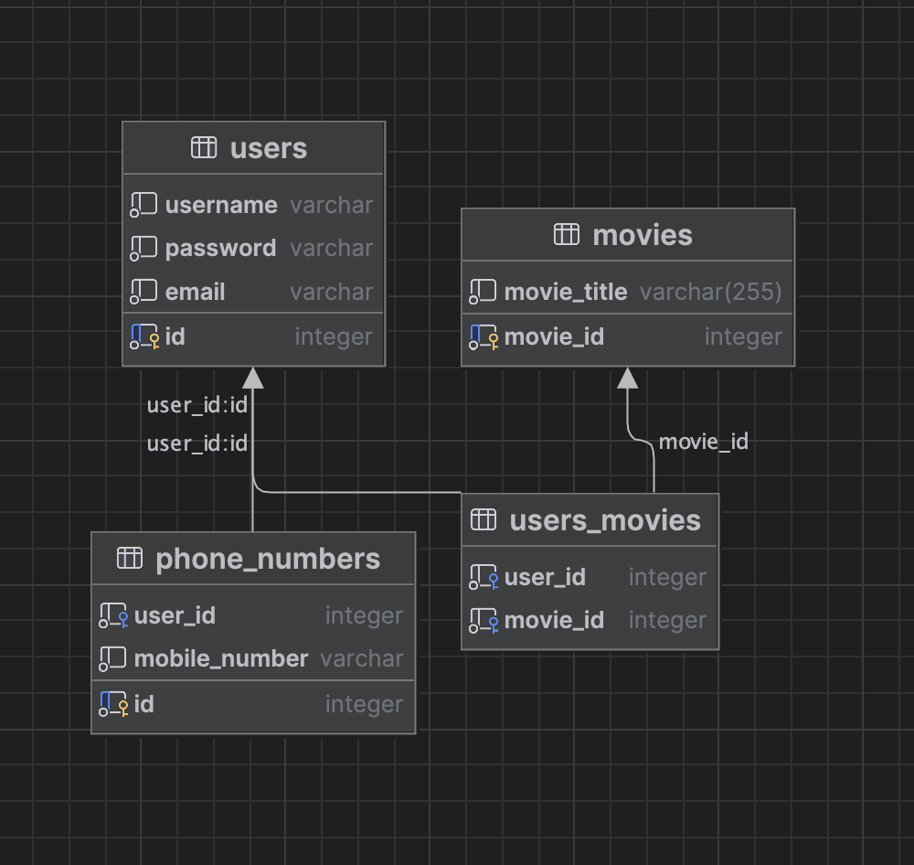

<h1>Requirements:</h1> 
User Registration and Authentication: 
Users should be able to create accounts. 
Users must log in to access personalized features. 
Users must have one or more location 
Allow users to add profile pictures 

  
Browse Movies: 
Display a list of available movies. 
  
Movie Details: 
Provide detailed information about each movie 

 

Favorites:
Allow users to create and manage their favorite movies . 
Allow users to watch a movie favorites users 

Email: 
Send users weekly email with popular movies 

<h1>Topics:</h1>
Exception Handler (db exception ✅, TMDB client exception ✅, validation exception ✅)  
Email - SMTP (cronjob to send weekly emails - list of movies) ✅  
unit/integration testing ✅  
Redis (movie details) ✅  
DB with flyway ✅  
Auth - JWT ✅  
2FA - OTP ✅  
Validation ✅  
logging ✅  
Files - FTP ✅  

<h1>End Points:</h1>
GET v1/movies  
GET v1/movies/{id}  
POST v1/users  
POST v1/users/phone-numbers  

<h1>Database</h1>
 

